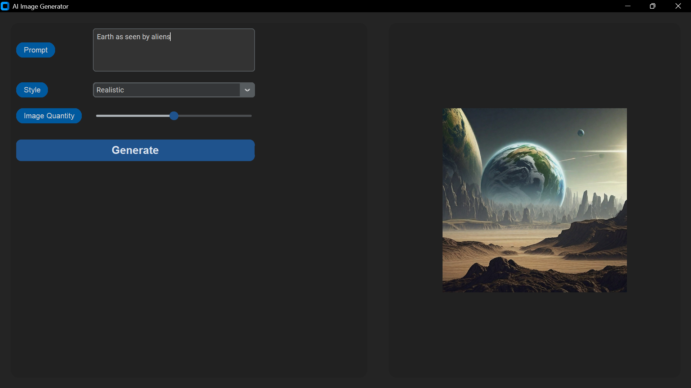

# Project Idea Generator
Uses **`nvidia/consistory`**, an AI model, to generate images based on user prompt.

## Interface


## Installation

```bash
git clone https://github.com/Sabique-Islam/Tkinter-basics
```
```bash
cd Tkinter-basics/image-generator
```
```bash
pip install -r requirements.txt
```
```bash
python main.py
```
## Set Up Your API Key
This application requires an API key to interact with the NVIDIA API that provides access to `nvidia/consistory`. Follow these steps to set it up:

1. **Generate an API Key:**
   - [Click here](https://build.nvidia.com/nvidia/consistory).
   - Click on `Build with this NIM`.
   - Complete the login process.
   - Generate a new API key and copy it.

2. **Add Your API Key:**
   - Create a `.env` file in the `image-generator` folder.
   - Add the following line to the `.env` file:

     ```env
     API_KEY=your_api_key
     ```

     Replace `your_api_key` with the your API key.

## Resources
- CustomTkinter [documentation](https://customtkinter.tomschimansky.com/documentation/).