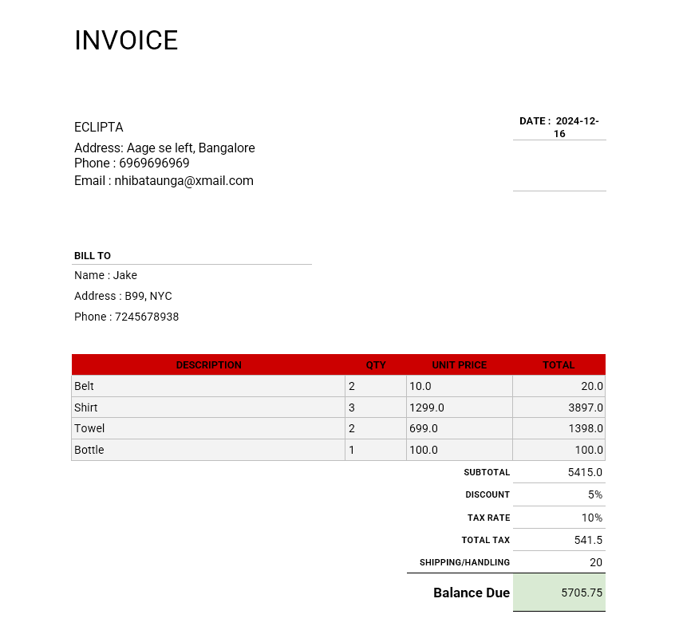

# Invoice Generator

Desktop application for generating invoices. Built using Tkinter library for the GUI.

## Features

- **Add Items to Invoice**: Input product details, quantity, and unit price to calculate the total for each item.
- **Generate Invoice**: Generates a formatted invoice document using a pre-defined Word template.
- **New Invoice**: Clears the current invoice details to start fresh.

## Interface


## Installation

1. Repository cloning:

   ```bash
   git clone https://github.com/Sabique-Islam/Tkinter-basics
   cd Tkinter-basics/invoice-generator
   ```

2. Install required libraries:

   ```bash
   pip install -r requirements.txt
   ```

## Usage

1. Run the application:

   ```bash
   python main.py
   ```

2. Enter customer details.
3. Add items to the invoice.
4. Click **Add Item** to add the product in the invoice.
5. After adding all the products, click **Generate Invoice** to generate the invoice.
6. To generate a new invoice, click **New Invoice**.

## Example

